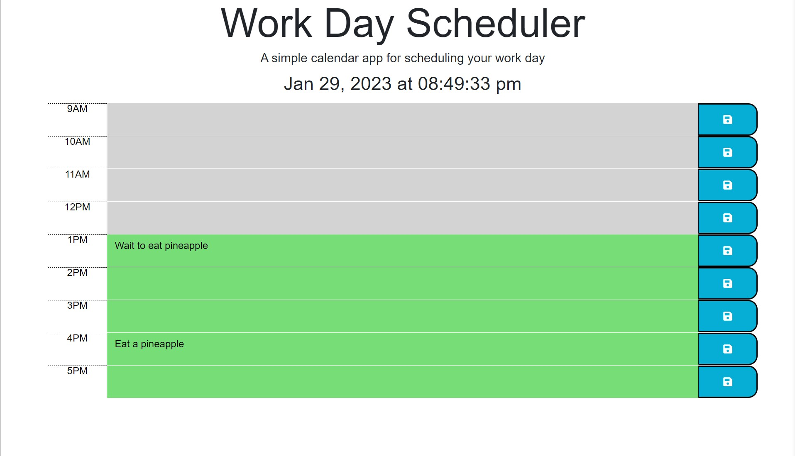

# Work Day Scheduler
Module 5:  A simple calendar site to assist with keeping your workday organized.

## Criteria 

1. WHEN the scheduler is opened, the current date and time is presented at the top of the page (relative to the user's timezone)

2. WHEN I scroll along the page, time blocks are clearly listed and color coded (past=grey, present=red, future=green)

3. WHEN I enter an event and press the save button, the event is kept in the local storage so the value persists when the page is refreshed

## Installation

1. Clone the repository with existing starter code provided by the UW coding bootcamp curriculum.

2. Edit the HTML to complete the work day time blocks.

3. Formulate javascript code to complete the previously listed criteria.

## Webpage Screenshot with link

Link https://terrinmack.github.io/Third-Party-API-Calendar/

## Contact

[Terri Mack](https://github.com/terrinmack?tab=repositories)

